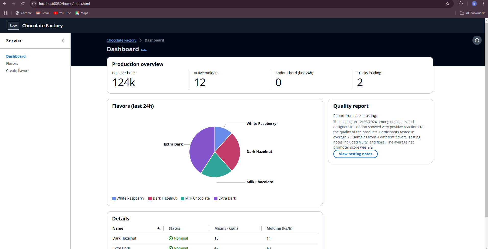
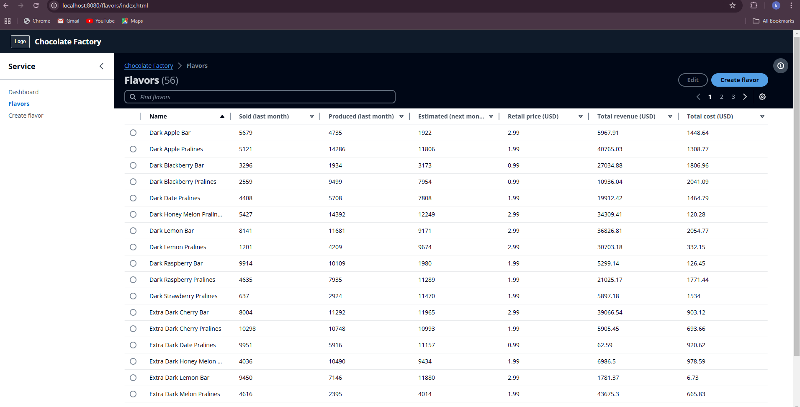
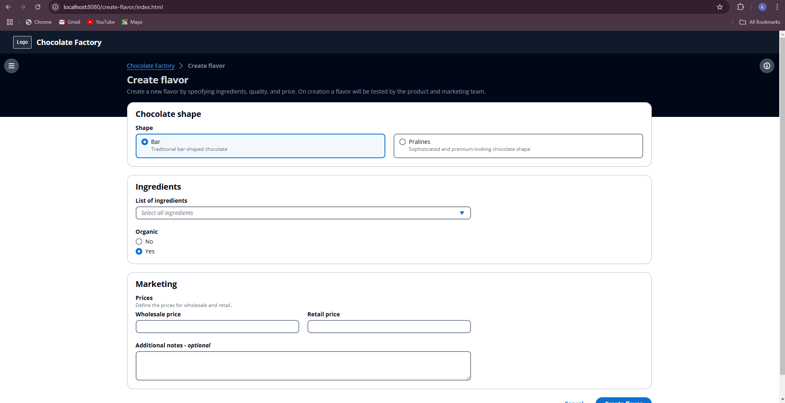

# Cloudscape Design System Workshop

This project is the result of completing the [Cloudscape Design System Workshop](https://catalog.us-east-1.prod.workshops.aws/workshops/5b7fe737-7ea2-4c4d-b572-76df6adabd47/en-US). The workshop uses the open source Cloudscape Design System to build a responsive and accessible web application for cloud management. The web application will leverage the open-source React components offered by Cloudscape.

## Overview

The development started with an empty React TypeScript project and finished by building a basic Chocolate Factory application using Cloudscape components.

## Application Layout

The project development was divided into three main steps:

### Step 1: Create the Basic Layout

In this step, we set up the foundational layout of the application, establishing the primary structure and navigation elements.



### Step 2: Add a Table View

Here, we incorporated a table view to display data in a structured tabular format, utilizing Cloudscape's table components for enhanced functionality and accessibility.



### Step 3: Add a Creation Flow

In the final step, we implemented a creation flow, enabling users to add new data entries through a user-friendly form interface.



## Getting Started

To run this project locally:

1. **Install dependencies:**

   ```bash
   npm install

2. **Start the development server**
3. 
     ```bash
   npm run dev

## Connect with me

**Kanika Mathur**  
- [E-mail](mkanika.90@gmail.com)
- [GitHub](https://github.com/KanikaGenesis)  
- [LinkedIn](https://www.linkedin.com/in/kanika-mathur-083080121)

## License

This project from AWS is licensed under the MIT No Attribution License (MIT-0). For more details, see the [LICENSE](cloudscape-design-system-workshop/LICENSE) file.

